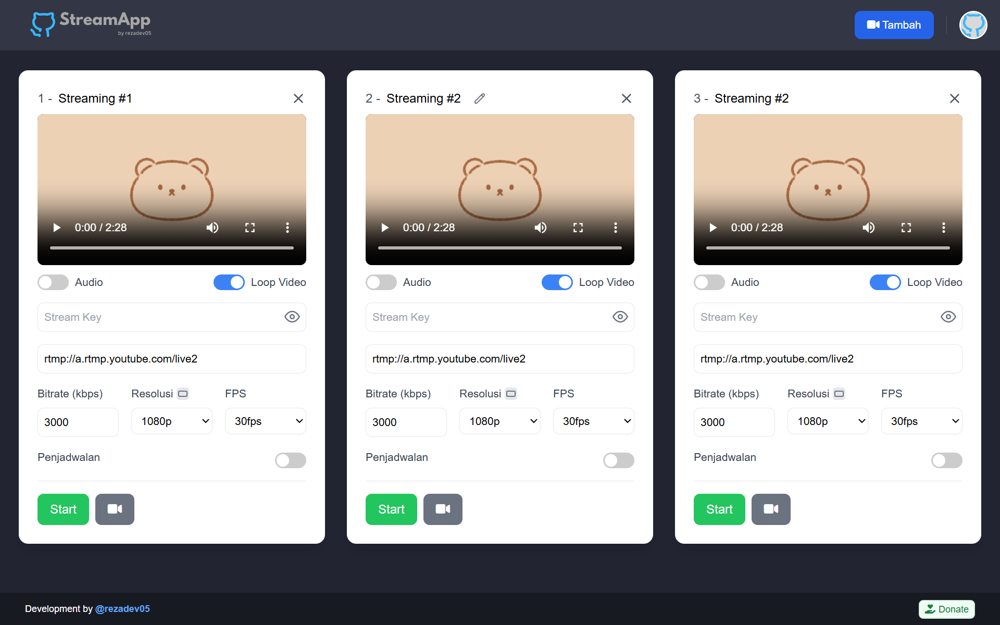

[](#table-of-contents)

<br>
<div align="center">

</div>
<br>

# 🎥 StreamApp - Application For Live Streaming With RTMP Protcol.

<p align="center">

</p>

StreamApp is a live streaming application, which allows you to go live on multiple platforms such as YouTube, Facebook and others. Using <b>RTMP</b> protocol, it can be run on VPS and other servers.

<p align="center">
   
   </p>

<p align="center">
   <b>### How To Install ###</b>
</p>

```bash
$ apt update && apt upgrade
$ apt install git -y
$ apt install nodejs -y
$ apt install ffmpeg -y
$ npm install -g pm2
$ git clone https://github.com/rezadev05/stream-app.git
$ cd stream-app
$ npm install
$ pm2 start ecosystem.config.js --only stream-app
```

> **⚠️** <b>Note</b> This program must be run using nodejs version 20 or higher!

## Thanks To

- [`bangtutorial`](https://github.com/bangtutorial) (Base This Program⭐)
- [`rezadev05`](https://github.com/rezadev05)

`I would like to thank all contributors who helped create this source code.`

## Donate

<a href="https://saweria.co/rezadev05" target="_blank"></a>
<a href="https://github.com/rezadev05/rezadev05/blob/main/bitcoin.json" target="_blank"></a>

## License

[MIT License](https://github.com/rezadev05/stream-app/LICENSE)

`Copyright (c) 2025 rezadev05`
